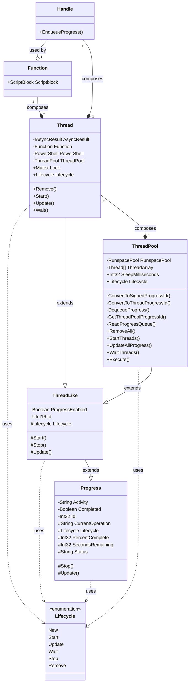

# Structure

```mermaid
classDiagram
class Lifecycle{
	<<enumeration>>
	New
	Start
	Update
	Wait
	Stop
	Remove
}
class Progress{
	-String Activity
	-Boolean Completed
	-Int32 Id
	#String CurrentOperation
	#Lifecycle Lifecycle
	#Int32 PercentComplete
	#Int32 SecondsRemaining
	#String Status
	#Stop()
	#Update()
}
class ThreadLike{
	-Boolean ProgressEnabled
	-UInt16 Id
	#Lifecycle Lifecycle
	#Start()
	#Stop()
	#Update()
}
class Thread{
	-IAsyncResult AsyncResult
	-Function Function
	-PowerShell PowerShell
	-ThreadPool ThreadPool
	+Mutex Lock
	+Lifecycle Lifecycle
	+Remove()
	+Start()
	+Update()
	+Wait()
}
class ThreadPool{
	-RunspacePool RunspacePool
	-Thread[] ThreadArray
	+Int32 SleepMilliseconds
	-ConvertToSignedProgressId()
	-ConvertToThreadProgressId()
	-DequeueProgress()
	-GetThreadPoolProgressId()
	-ReadProgressQueue()
	+Lifecycle Lifecycle
	+RemoveAll()
	+StartThreads()
	+UpdateAllProgress()
	+WaitThreads()
	+Execute()
}
class Handle{
	+EnqueueProgress()
}
class Function{
	+ScriptBlock Scriptblock
}

Function "1" --* "1" Thread : composes
Handle "1" --o "1" Function : used by
Handle "1" --* "1" Thread : composes
Progress ..> Lifecycle : uses
Thread ..> Lifecycle : uses
Thread --|> ThreadLike : extends
Thread "1..*" --* "1" ThreadPool : composes
ThreadLike ..> Lifecycle : uses
ThreadLike --|> Progress : extends
ThreadPool ..> Lifecycle : uses
ThreadPool --|> ThreadLike : extends
```
