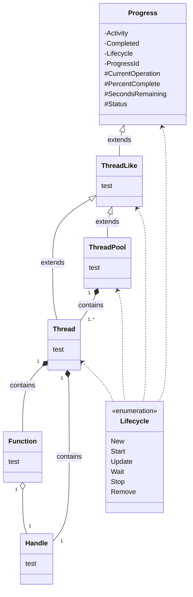

# Structure

```mermaid
classDiagram
class Lifecycle{
	<<enumeration>>
	New
	Start
	Update
	Wait
	Stop
	Remove
}
class Progress{
	-Activity
	-Completed
	-Lifecycle
	-ProgressId
	#CurrentOperation
	#PercentComplete
	#SecondsRemaining
	#Status
}
class ThreadLike{
	test
}
class Thread{
	test
}
class ThreadPool{
	test
}
class Handle{
	test
}
class Function{
	test
}

Progress <|-- ThreadLike : extends
Progress <.. Lifecycle
ThreadLike <|-- Thread : extends
ThreadLike <|-- ThreadPool : extends
ThreadLike <.. Lifecycle
ThreadPool "1" *-- "1..*" Thread : contains
ThreadPool <.. Lifecycle
Thread "1" *-- Function : contains
Thread "1" *-- "1" Handle : contains
Thread <.. Lifecycle
Function "1" o-- "1" Handle
```
